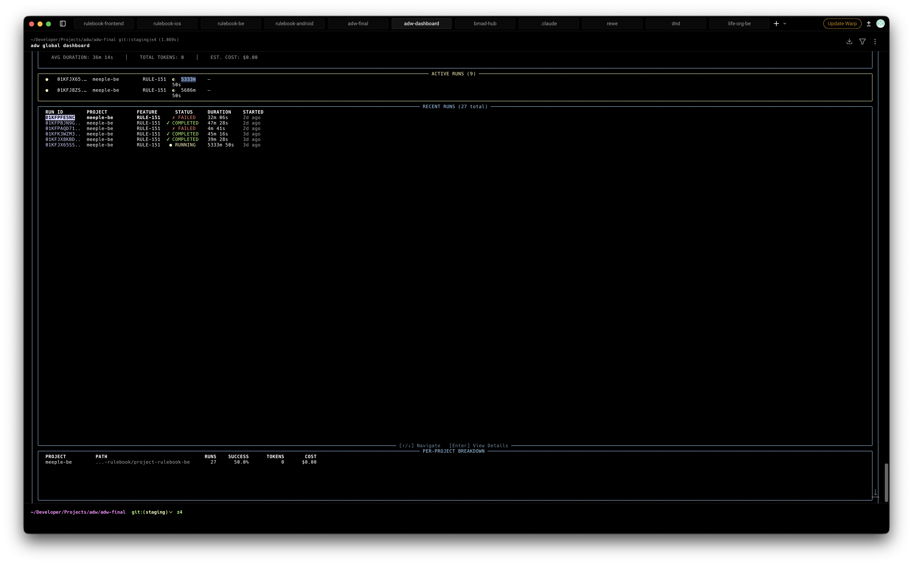

# Issue: Dashboard layout and display issues - spacing, truncation, and token display

**ID:** ISS-041
**Severity:** Major
**Type:** UX Issue
**Status:** reported
**Reported:** 2026-01-26
**Reporter:** Ivo

## Related

- **Epic:** 16
- **Story:** 16-5
- **Component:** TUI Dashboard

## Description

Multiple display issues in the global dashboard TUI:
1. Recent runs section has excessive whitespace - takes up ~50 lines when only 6 runs shown
2. Active runs section layout confusing - duration split across two lines ("5333m" / "50s") with unclear meaning
3. Run IDs truncated with "..." despite ample horizontal space available
4. Token count shows 0 in both summary and per-project breakdown, likely not being aggregated

## Reproduction Steps

1. Run `adw global dashboard`
2. Observe the layout issues in the TUI

## Expected Behavior

1. Recent runs section should be sized to content (no empty space)
2. Active runs should show duration clearly on one line (e.g., "5333m 50s" or "88h 53m")
3. Run IDs should use available horizontal space without unnecessary truncation
4. Token counts should display actual values from run data

## Actual Behavior

- Recent runs panel takes up most of the vertical space with empty rows
- Active runs show duration on two separate lines, confusing the display
- Run IDs show as "01KFJX65..." even with plenty of horizontal room
- Tokens show as 0 and cost as $0.00 despite runs having used tokens

## Impact

Dashboard is harder to read and interpret at a glance. Token/cost tracking appears broken, defeating the purpose of the cost monitoring feature.

## User Impact Score

- **Users Affected:** All dashboard users
- **Frequency:** Every dashboard invocation

## Workaround

None - visual issues only. Use CLI commands for accurate token data.

## Environment

- **OS:** macOS
- **App Version:** 0.1.41
- **DPI Scaling:** 100%

## Evidence

### Screenshots

### Logs

N/A

### Screen Recording

N/A

## Resolution

- **Fix Story:** ux-fix-ISS-041-dashboard-layout-display-issues
- **Fixed In:** Pending
- **Verified By:** Pending
- **Verified Date:** Pending

## Notes

Issues identified:
1. **Whitespace** - Recent runs table should use `height="auto"` or similar to fit content
2. **Duration display** - Active runs showing minutes and seconds on separate lines needs layout fix
3. **ID truncation** - Column width calculation not using available terminal width
4. **Token aggregation** - Token/cost data not being read from run context files or not persisted
