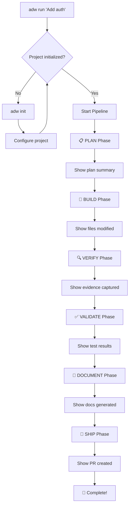
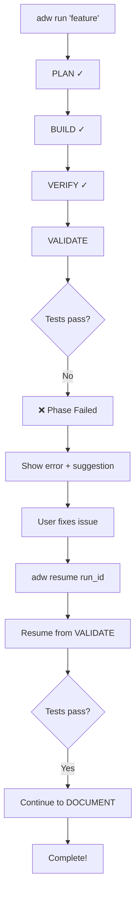
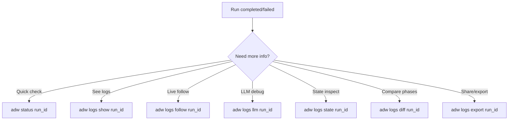

# UX Design Specification: adw-sdk

**Author:** Ivo
**Date:** 2025-12-31

---

## Executive Summary

### Project Vision

ADW-SDK transforms AI-assisted development from ad-hoc prompting into a deterministic, observable pipeline. The UX challenge: make a complex multi-phase automation system feel **trustworthy**, **transparent**, and **effortless**.

**The Promise:** Developer provides a small prompt → receives a fully implemented, validated feature with a detailed PR, evidence, and documentation.

### Target Users

| Persona | Profile | UX Priority |
|---------|---------|-------------|
| **Alex** (Primary) | Solo dev, mid-senior, uses AI daily | Speed, minimal babysitting, clear feedback |
| **Jordan** (Secondary) | Tech lead, 3-8 devs | Auditability, consistency, team patterns |
| **Morgan** (Tertiary) | Enterprise architect | Compliance, observability, integration |

### Key Design Challenges

1. **Streaming Output Clarity** — LLM streams in real-time; must distinguish "thinking" vs "doing" vs "done"
2. **Long-Running Process Feedback** — Runs take 1-10+ minutes; users need confidence system isn't stuck
3. **Failure Recovery UX** — Resumption is core; users must understand *where* they are and *why* it failed
4. **Observability Without Overwhelm** — 8+ log subcommands; progressive disclosure needed
5. **Configuration Discoverability** — Three-tier override system; must be findable without front-loading

### Design Opportunities

1. **Trust Through Transparency** — Rich terminal output creates premium CLI feel
2. **Prompt-to-PR Magic Moment** — First successful run is key adoption moment
3. **Time Travel Debugging** — State snapshots enable unique "git for AI runs" UX

---

## Core User Experience

### Defining Experience

**Core User Action:** `adw run "Add user authentication"`

This single command encapsulates the entire value proposition. Everything else supports this action or helps recover when it fails.

**Experience Flow:**
```
User types command → Pipeline starts → Progress visible → Artifacts accumulate → PR created
```

### Platform Strategy

| Aspect | Decision |
|--------|----------|
| **Platform** | CLI (macOS, Linux, Windows via WSL) |
| **Input** | Keyboard-only, non-interactive by default |
| **Output** | Terminal (TTY), supports piping |
| **Installation** | `uv tool install adw` |

### Effortless Interactions

**Should Be Effortless:**
- Starting a run (single command)
- Seeing current progress (always visible)
- Understanding what went wrong (actionable errors)
- Resuming after failure (`adw resume` just works)

**Should Be Zero-Config by Default:**
- Sensible phase defaults
- Auto-detected project type
- Default prompts that work

### Critical Success Moments

| Moment | User Feels | Design Goal |
|--------|-----------|-------------|
| **First run completes** | "This actually works!" | Celebratory completion message |
| **Phase transitions** | "Progress is happening" | Clear visual checkpoint |
| **Resume succeeds** | "I didn't lose my work" | Seamless continuation |
| **Error with suggestion** | "I know what to fix" | Actionable next step |

### Experience Principles

1. **Progress Over Silence** — Always show something is happening
2. **Errors Are Guidance** — Every failure includes a suggested fix
3. **Depth On Demand** — Simple by default, `--verbose` for details
4. **Artifacts Build Confidence** — Show value accumulating visually

---

## Desired Emotional Response

### Primary Emotional Goals

| Emotion | Why It Matters | How to Achieve |
|---------|---------------|----------------|
| **Trust** | Users must believe the system will complete correctly | Transparency, checkpoints, audit trail |
| **Confidence** | Users must feel in control even during automation | Clear progress, ability to abort, resume capability |
| **Relief** | Users should feel burden lifted | "Set and forget" capability, minimal babysitting |

### Emotional Journey Mapping

```
Discovery → "This might actually solve my problem"
First Run → "It's doing things!" → "Is it still working?" → "It finished!"
Success   → "This is exactly what I needed"
Failure   → "I understand what went wrong" → "Resume worked!"
Adoption  → "I use this for everything now"
```

### Micro-Emotions

| State | Target | Anti-Target |
|-------|--------|-------------|
| During LLM execution | Curious anticipation | Anxious waiting |
| During phase transition | Satisfying checkpoint | Jarring interruption |
| On error | Informed determination | Frustrated confusion |
| On completion | Earned accomplishment | Anti-climactic end |

### Emotional Design Principles

1. **Anticipation > Anxiety** — Streaming output keeps users engaged, not worried
2. **Checkpoint Satisfaction** — Phase completions feel like mini-wins
3. **Failure is Learning** — Errors teach, not punish
4. **Completion is Celebration** — The PR creation moment should feel earned

---

## Design System Foundation

### CLI Design System: Rich + Typer

**Foundation:** Python Rich library provides the component system for terminal UX.

**Why Rich:**
- Mature, well-documented terminal UI framework
- Progress bars, panels, tables, syntax highlighting built-in
- Handles concurrent output without flickering
- Unicode/emoji support with fallbacks
- Consistent across platforms

### Core Components (Rich)

| Component | Use Case | Rich Class |
|-----------|----------|------------|
| **Progress Bar** | Phase progress, LLM thinking | `Progress`, `SpinnerColumn` |
| **Panel** | Artifact summaries, errors | `Panel` |
| **Table** | Run status, log listings | `Table` |
| **Syntax** | Code diffs, config display | `Syntax` |
| **Tree** | File structure, artifact hierarchy | `Tree` |
| **Live** | Real-time streaming output | `Live` |
| **Console** | All styled output | `Console` |

### Visual Tokens

**Colors (Terminal Palette):**

| Token | Color | Hex | Usage |
|-------|-------|-----|-------|
| `success` | Green | `#00FF00` | Completed phases, success messages |
| `error` | Red | `#FF0000` | Failures, critical errors |
| `warning` | Yellow | `#FFFF00` | Warnings, cautions |
| `info` | Cyan | `#00FFFF` | Informational messages |
| `muted` | Gray | `#808080` | Secondary info, timestamps |
| `accent` | Magenta | `#FF00FF` | Highlights, phase names |
| `primary` | White | `#FFFFFF` | Primary text |

**Typography:**
- Monospace only (terminal constraint)
- Bold for emphasis
- Dim for secondary information
- Italic for user-provided content (feature request)

### Verbosity Levels

| Level | Flag | Shows |
|-------|------|-------|
| `quiet` | `-q` | Errors only, final result |
| `normal` | (default) | Phase progress, key milestones |
| `verbose` | `-v` | Phase details, artifact summaries |
| `trace` | `--trace` | Full LLM output, debug info |

---

## User Journey Flows

### Journey 1: First Run (Happy Path)



**Terminal Output Sketch:**
```
$ adw run "Add user authentication with OAuth"

╭─ ADW Run: 01HQXK5P3Z7V8R2M4N6T9W1Y3C ─────────────────────────╮
│ Feature: Add user authentication with OAuth                   │
╰───────────────────────────────────────────────────────────────╯

[PLAN] ━━━━━━━━━━━━━━━━━━━━━━━━━━━━━━━━━━━━━━━━━━━━━━━━━━ 100%
   ✓ Generated plan.md (12 steps, 8 files)

[BUILD] ━━━━━━━━━━━━━━━━━━━━━━━━━━━━━━━━━━━━━━━━━━━━━━━━━ 100%
   ✓ Created 3 files, modified 2 files (+412 lines)

[VERIFY] ━━━━━━━━━━━━━━━━━━━━━━━━━━━━━━━━━━━━━━━━━━━━━━━━ 100%
   ✓ Captured 4 evidence items (screenshots, API responses)

[VALIDATE] ━━━━━━━━━━━━━━━━━━━━━━━━━━━━━━━━━━━━━━━━━━━━━━ 100%
   ✓ 142 tests passed, 87.5% coverage

[DOCUMENT] ━━━━━━━━━━━━━━━━━━━━━━━━━━━━━━━━━━━━━━━━━━━━━━ 100%
   ✓ Generated docs.md, updated CHANGELOG

[SHIP] ━━━━━━━━━━━━━━━━━━━━━━━━━━━━━━━━━━━━━━━━━━━━━━━━━━ 100%
   ✓ Created PR #142: https://github.com/org/repo/pull/142

╭─ Run Complete ────────────────────────────────────────────────╮
│                                                               │
│  PR: https://github.com/org/repo/pull/142                    │
│  Artifacts: .adw/runs/01HQXK5P3Z7V8R2M4N6T9W1Y3C/            │
│  Duration: 4m 32s                                             │
│                                                               │
╰───────────────────────────────────────────────────────────────╯
```

### Journey 2: Failure and Recovery



**Error Output Sketch:**
```
[VALIDATE] ━━━━━━━━━━━━━━━━━━━━━━━━━━━━━━━━━━━━━━━━━━━━━━ FAILED

╭─ Phase Failed: VALIDATE ──────────────────────────────────────╮
│                                                               │
│  Error: 2 tests failed                                        │
│                                                               │
│  Failed Tests:                                                │
│  • src/auth/__tests__/oauth.test.ts:45                       │
│    "should handle token refresh"                              │
│    Expected token refresh, got 401                            │
│                                                               │
│  Suggestion: Implement /auth/refresh endpoint                 │
│  See: .adw/runs/.../artifacts/validate/test_results.json     │
│                                                               │
│  To resume after fixing:                                      │
│  $ adw resume 01HQXK5P3Z7V8R2M4N6T9W1Y3C                     │
│                                                               │
╰───────────────────────────────────────────────────────────────╯
```

### Journey 3: Observability Deep Dive



---

## Component Strategy

### Terminal Output Components

#### 1. Phase Progress Component

```
[PLAN] ━━━━━━━━━━━━━━━━━━━━━━━━━━━━━━━━━━━━━━━━━━━━━━━━━━ 100%
   ✓ Generated plan.md (12 steps, 8 files)
```

**States:**
- `pending`: Gray, no progress bar
- `active`: Cyan, animated spinner + progress bar
- `complete`: Green checkmark, 100% bar
- `failed`: Red X, partial bar

#### 2. Run Header Component

```
╭─ ADW Run: 01HQXK5P3Z7V8R2M4N6T9W1Y3C ─────────────────────────╮
│ Feature: Add user authentication with OAuth                   │
│ Started: 2025-01-15 10:30:00                                  │
╰───────────────────────────────────────────────────────────────╯
```

#### 3. Error Panel Component

```
╭─ Phase Failed: VALIDATE ──────────────────────────────────────╮
│                                                               │
│  Error: {error_message}                                       │
│  Suggestion: {actionable_suggestion}                          │
│  To resume: $ adw resume {run_id}                            │
│                                                               │
╰───────────────────────────────────────────────────────────────╯
```

#### 4. Completion Panel Component

```
╭─ Run Complete ────────────────────────────────────────────────╮
│                                                               │
│  PR: {pr_url}                                                 │
│  Artifacts: {artifacts_path}                                  │
│  Duration: {duration}                                         │
│                                                               │
╰───────────────────────────────────────────────────────────────╯
```

#### 5. LLM Streaming Component

During `--verbose` or `--trace`, show LLM output:

```
┌─ Claude Code ─────────────────────────────────────────────────┐
│ I'll start by creating the OAuth provider...                  │
│ ▌                                                             │
└───────────────────────────────────────────────────────────────┘
```

#### 6. Artifact Summary Component

```
╭─ Artifacts ───────────────────────────────────────────────────╮
│                                                               │
│  plan/                                                        │
│  ├── plan.md (2.4 KB)                                        │
│  └── plan.json (1.1 KB)                                      │
│  build/                                                       │
│  ├── files_modified.json                                     │
│  └── build_summary.md                                        │
│                                                               │
╰───────────────────────────────────────────────────────────────╯
```

---

## UX Patterns

### Pattern 1: Progressive Disclosure

| Context | Default | On Flag |
|---------|---------|---------|
| Run output | Phase summaries | `--verbose`: Phase details |
| Errors | Error + suggestion | `--trace`: Full stack trace |
| Logs | Key events | `--trace`: All events |

### Pattern 2: Consistent Phase Display

Every phase follows the same visual structure:
1. Phase header with icon + name
2. Progress bar (animated during execution)
3. Completion summary line

### Pattern 3: Actionable Errors

Every error includes:
1. **What failed** — Clear description
2. **Why** — Root cause if determinable
3. **Suggested fix** — Actionable next step
4. **Resume command** — Exact command to continue

### Pattern 4: Command Discoverability

```
$ adw --help

Usage: adw <command> [options]

Commands:
  run <feature>       Run the full pipeline
  resume <run_id>     Resume from failure
  status <run_id>     Check run status
  logs <subcommand>   View logs and artifacts
  init                Initialize project

Run 'adw <command> --help' for more information.
```

### Pattern 5: Status at a Glance

```
$ adw status 01HQXK5P3Z7V8R2M4N6T9W1Y3C

╭─ Run Status ──────────────────────────────────────────────────╮
│                                                               │
│  ID: 01HQXK5P3Z7V8R2M4N6T9W1Y3C                              │
│  Feature: Add user authentication                             │
│  Status: FAILED at VALIDATE                                   │
│  Duration: 3m 45s (paused)                                    │
│                                                               │
│  Phases:                                                      │
│  ✓ PLAN      ✓ BUILD     ✓ VERIFY     ❌ VALIDATE            │
│                                                               │
│  To resume: adw resume 01HQXK5P3Z7V8R2M4N6T9W1Y3C           │
│                                                               │
╰───────────────────────────────────────────────────────────────╯
```

---

## Responsive Design (Terminal Contexts)

### Terminal Width Adaptation

| Width | Behavior |
|-------|----------|
| < 60 cols | Compact mode, abbreviated output |
| 60-120 cols | Standard mode |
| > 120 cols | Wide mode, additional columns |

### Non-TTY Mode (Piping/CI)

When stdout is not a TTY:
- Disable colors and formatting
- Disable progress animations
- Output machine-readable format
- Exit codes for CI integration

### Accessibility

**Screen Reader Compatibility:**
- All emoji have text fallbacks
- Progress announced as percentages
- Clear section breaks
- No reliance on color alone

**High Contrast Support:**
- Works with terminal high-contrast themes
- Bold/dim distinguish hierarchy
- Symbols (✓, ❌) supplement colors

---

## Implementation Guidelines

### Console Output Rules

1. **Never print without Rich** — All output through `Console()`
2. **Respect verbosity** — Check level before detailed output
3. **Buffer streaming** — Don't overwhelm with rapid output
4. **Clean interruption** — Ctrl+C shows graceful abort message

### Error Message Template

```python
error_panel = Panel(
    f"""[bold red]Error:[/] {error.message}

[bold]Suggestion:[/] {error.suggestion}

[dim]To resume after fixing:[/]
$ adw resume {run_id}""",
    title="Phase Failed: {phase}",
    border_style="red"
)
```

### Phase Progress Template

```python
with Progress(
    SpinnerColumn(),
    TextColumn("[bold]{task.description}"),
    BarColumn(),
    TaskProgressColumn(),
    TextColumn("{task.fields[tokens]} tokens | {task.fields[elapsed]}"),
) as progress:
    task = progress.add_task("[PLAN]", total=100, tokens=0, elapsed="0:00")
    # Update progress.update(task, advance=N, tokens=count, elapsed=time)
```

---

## UX Decisions (Resolved)

| Decision | Choice | Rationale |
|----------|--------|-----------|
| **Emoji Usage** | Text-only `[PLAN]` `[BUILD]` etc. | Maximum terminal compatibility |
| **Default Verbosity** | `normal` shows phase summaries only | LLM streaming available via `--verbose` |
| **Ctrl+C Behavior** | Prompt "Abort run? (y/n)" | Prevents accidental termination |
| **LLM Progress Display** | Spinner + token count + elapsed time | Provides concrete feedback during unpredictable duration |
| **First-Run Experience** | Interactive setup wizard | Guides users through initial config |
| **Color Customization** | Fixed colors, no config | Consistency across all installations |
| **Completion Notification** | None | Stay pure CLI, no bells or desktop notifications |

---

## Additional Commands

### Run Management

```
$ adw runs list

╭─ Recent Runs ─────────────────────────────────────────────────╮
│                                                               │
│  ID                          Status      Feature              │
│  01HQXK5P3Z7V8R2M4N6T9W1Y3C  ✓ Complete  Add OAuth auth       │
│  01HQXK4M2Y6U7Q1L3K5H8V0X2B  ✗ Failed    Fix login bug        │
│  01HQXK3J1W5T6P0K2J4G7U9W1A  ✓ Complete  Add dark mode        │
│                                                               │
╰───────────────────────────────────────────────────────────────╯
```

### Configuration Preview

```
$ adw config show

╭─ Effective Configuration ─────────────────────────────────────╮
│                                                               │
│  Source: .adw/config.yaml (project)                          │
│  Overrides: ~/.config/adw/config.yaml (user)                 │
│                                                               │
│  project:                                                     │
│    name: my-app                                               │
│    language: python                                           │
│    platform: backend                                          │
│                                                               │
│  phases:                                                      │
│    plan:                                                      │
│      timeout: 300                                             │
│    build:                                                     │
│      timeout: 600  # (from user config)                      │
│                                                               │
╰───────────────────────────────────────────────────────────────╯
```

### Dry Run Mode

`--dry-run` executes the PLAN phase only and displays what *would* happen:

```
$ adw run "Add feature" --dry-run

╭─ Dry Run ─────────────────────────────────────────────────────╮
│ This is a preview. No changes will be made.                   │
╰───────────────────────────────────────────────────────────────╯

[PLAN] ━━━━━━━━━━━━━━━━━━━━━━━━━━━━━━━━━━━━━━━━━━━━━━━━━━ 100%
   ✓ Generated plan (preview only)

╭─ Planned Changes ─────────────────────────────────────────────╮
│                                                               │
│  Files to create:                                             │
│  • src/auth/oauth.py                                         │
│  • src/auth/tokens.py                                        │
│                                                               │
│  Files to modify:                                             │
│  • src/app.py                                                │
│  • src/routes/auth.py                                        │
│                                                               │
│  Phases that would run:                                       │
│  [PLAN] → [BUILD] → [VERIFY] → [VALIDATE] → [DOCUMENT] → [SHIP]│
│                                                               │
│  To execute: adw run "Add feature"                           │
│                                                               │
╰───────────────────────────────────────────────────────────────╯
```

### Interactive vs Non-Interactive Mode

| Mode | Behavior |
|------|----------|
| **Interactive** (default when TTY) | Setup wizard on first run, Ctrl+C confirmation prompt, potential approval gates |
| **Non-Interactive** (`--no-interactive`) | No prompts, fail fast on missing config, CI/CD friendly |

---

## Updated Component Examples

### Phase Progress (Text-Only)

```
[PLAN] ━━━━━━━━━━━━━━━━━━━━━━━━━━━━━━━━━━━━━━━━━━━━━━━━━━ 100%
   ✓ Generated plan.md (12 steps, 8 files)

[BUILD] ━━━━━━━━━━━━━━━━━━━━━━━━━━━━━━━━━━━━━━━━━━━━━━━━━ 100%
   ✓ Created 3 files, modified 2 files (+412 lines)
```

### LLM Execution Progress

```
[BUILD] ⠋ Executing... 1,247 tokens | 0:45 elapsed
```

### Interrupt Prompt

```
^C
Abort run? This will save a checkpoint at the current phase.
Resume later with: adw resume 01HQXK5P3Z7V8R2M4N6T9W1Y3C

Abort? [y/N]:
```

---

*UX Design Specification completed on 2025-12-31*
*Updated with resolved decisions on 2025-12-31*
