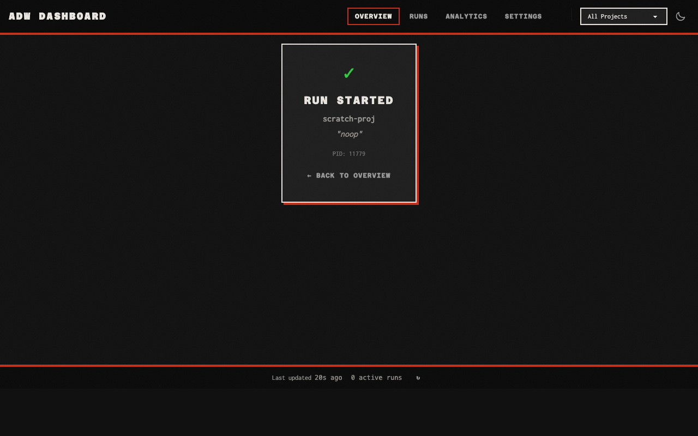

# Validation: Remove the webhook server

Validated on `feature/adw-19` at `0a14ea45`, merge-base `1212c5b4` (`origin/staging`), 2026-09-23.

## Acceptance criteria

| Criterion | Result | Evidence |
|---|---|---|
| `adw --help` lists no `webhook` group, and `adw webhook --help` exits non-zero with "No such command" | Met | [CLI surface](#cli-surface): the command list has no `webhook`; `No such command 'webhook'.`, `exit=2` |
| `grep -rn "adw.webhook\|adw.server\|WebhookConfig" src tests` returns nothing, and `grep -rni webhook src` matches only `src/adw/config/checker.py` | Met | [Greps](#greps) |
| `src/adw/webhook/`, `src/adw/server/`, `src/adw/models/webhook.py`, `src/adw/cli/webhook.py` and `src/adw/cli/wizard/webhooks.py` no longer exist | Met | [Greps](#greps): `ls` reports each one missing |
| A `project.yaml` holding the pre-epic wizard's `webhook:` block loads through `ConfigLoader` with no `webhook` key | Met | [RED/GREEN](#red--green): `test_load_ignores_removed_webhook_section` |
| `adw validate` on that file: 0 errors, one warning on `webhook`, exit 0; `--strict` exits 1 | Met | [RED/GREEN](#red--green): `test_removed_webhook_section_warns`; [old config](#old-config-under-adw-validate): `exit=0`, `exit=1` |
| `adw init --wizard` shows no webhook step, and the generated `project.yaml` has no webhook block | Met | [RED/GREEN](#red--green): `test_flow.py`, `test_summary.py`, `test_yaml_generator.py`; the scratch `adw init` config has 0 `webhook` lines |
| `adw dashboard web` starts, `/` returns 200, and New Run starts a mocked run in a scratch project | Met | [Dashboard and New Run](#dashboard-and-new-run): `200`, the run-started view, and the `completed` run in `adw list` |
| `grep -rni webhook docs --exclude-dir=artifacts` returns nothing | Met | [Greps](#greps): exit 1 |
| `scripts/preflight.sh` passes, and `uv run pytest` is green with coverage ≥ 80% | Met | [Preflight and tests](#preflight-and-tests): `preflight: ok`; 3,502 passed, 85.15% |

## Preflight and tests

```text
$ scripts/preflight.sh
All checks passed!
==> ruff format --check
134 files already formatted
==> mypy
Success: no issues found in 134 source files
preflight: ok

$ uv run pytest
TOTAL                                    11211   1445   3298    344    85%
Required test coverage of 80% reached. Total coverage: 85.15%
================= 3502 passed, 5 skipped in 199.89s (0:03:19) ==================
```

The plan's baseline was 3,817 passed at 85.05% coverage on `be1d5bf8`. Phase 2.4 (#208) landed on `staging` in between and deleted its own tests, so the drop is not all this plan's. Coverage rose by 0.10 points. CI (lint, typecheck, test) passed on every task commit of PR #212.

## CLI surface

```text
$ uv run adw --help   (Commands panel)
│ init              Initialize ADW in the current directory.                   │
│ run               Run the agentic development workflow.                      │
│ abort             Abort a running execution.                                 │
│ resume            Resume a failed or interrupted run.                        │
│ status            Show status of a run.                                      │
│ list              List recent runs.                                          │
│ pr                Create a GitHub PR from a completed run.                   │
│ register          Register current project in the ADW web dashboard.         │
│ unregister        Unregister current project from the ADW web dashboard.     │
│ projects          List registered projects.                                  │
│ validate          Validate ADW configuration files.                          │
│ cleanup           Clean up worktree and optionally branch for a run.         │
│ cleanup-orphans   Find and remove orphaned worktrees.                        │
│ logs              View logs and state for debugging                          │
│ dashboard         Dashboard commands for monitoring ADW runs                 │
│ global            Cross-project commands for viewing runs across all         │
│                   projects                                                   │
$ uv run adw --help | grep -ci webhook
0

$ uv run adw webhook --help
Try 'adw --help' for help.
╭─ Error ──────────────────────────────────────────────────────────────────────╮
│ No such command 'webhook'.                                                   │
╰──────────────────────────────────────────────────────────────────────────────╯
exit=2

$ uv run adw dashboard web --help | grep -ci webhook
0
```

Before TASK-001, `adw --help` listed `webhook  Webhook server commands for receiving external events` and `adw webhook --help` exited 0.

## Greps

```text
$ grep -rn "adw.webhook\|adw.server\|WebhookConfig" src tests
exit=1

$ grep -rni webhook src
src/adw/config/checker.py:32:    "webhook": "the webhook server was removed",

$ grep -rni webhook docs --exclude-dir=artifacts
exit=1

$ ls src/adw/webhook src/adw/server src/adw/models/webhook.py src/adw/cli/webhook.py src/adw/cli/wizard/webhooks.py
ls: src/adw/cli/webhook.py: No such file or directory
ls: src/adw/cli/wizard/webhooks.py: No such file or directory
ls: src/adw/models/webhook.py: No such file or directory
ls: src/adw/server: No such file or directory
ls: src/adw/webhook: No such file or directory
```

## RED / GREEN

TASK-002: the three flipped assertions, run before the wizard step was removed:

```text
FAILED tests/unit/cli/wizard/test_flow.py::TestWizardStep::test_step_values_exist
FAILED tests/unit/cli/wizard/test_summary.py::TestSummaryPanelGeneration::test_summary_panel_shows_all_sections
FAILED tests/unit/config/test_yaml_generator.py::TestYAMLWithComments::test_generate_project_yaml_has_all_sections
3 failed, 32 passed in 0.66s
```

After the removal, the same three passed (`3 passed in 0.48s`), and `tests/unit/cli tests/unit/config` passed with `794 passed`.

TASK-003: the two back-compat tests, run before the model and checker changed:

```text
E       AssertionError: assert 'webhook' not in {'build_command': None, 'framework': None, 'git': {...}, ...}
E       assert 0 == 1
E        +  where [] = CheckReport(results=[]).warnings
FAILED tests/unit/config/test_loader.py::TestConfigLoader::test_load_ignores_removed_webhook_section
FAILED tests/unit/config/test_checker.py::TestConfigCheckerProjectConfig::test_removed_webhook_section_warns
2 failed in 0.46s
```

After:

```text
tests/unit/config/test_loader.py::TestConfigLoader::test_load_ignores_removed_webhook_section PASSED [ 50%]
tests/unit/config/test_checker.py::TestConfigCheckerProjectConfig::test_removed_webhook_section_warns PASSED [100%]
============================== 2 passed in 0.30s ===============================
```

## Old config under `adw validate`

A scratch git repo with the pre-epic fixture from RESEARCH.md in `.adw/project.yaml`, and a scratch `HOME`:

```text
$ adw validate
  .adw/project.yaml ....................... 1 warning
  plan .................................... OK
  build ................................... OK
  validate ................................ OK
  document ................................ OK
  ship .................................... OK
    ⚠ webhook: 'webhook' is no longer used and is ignored: the webhook server
was removed
      Suggestion: Delete the 'webhook:' section from project.yaml

  Result: 0 errors, 1 warning — configuration is valid
exit=0

$ adw validate --strict
  ...same report...
  Result: 0 errors, 1 warning — configuration is valid
exit=1
```

The warning's details print below the `ship` row. `validate_config_display.py` always prints `project.yaml` details after the phase rows, so this layout predates this plan.

## Dashboard and New Run

A scratch `HOME` and a scratch git repo with one commit, set up with `adw init --no-interactive --language python` and `adw register`. The generated `project.yaml` has no webhook lines (`grep -ci webhook .adw/project.yaml` → `0`). The server ran as `ADW_MOCK_EXECUTOR=1 adw dashboard web --no-browser --port 8765`.

```text
$ curl -s -o /dev/null -w "%{http_code}\n" http://127.0.0.1:8765/
200
$ curl -si http://127.0.0.1:8765/health
HTTP/1.1 200 OK
{"status":"healthy","service":"dashboard"}

# server log: the lifespan still reads host/port from app.state
ADW Dashboard Server Starting
  Host: 127.0.0.1
  Port: 8765
  URL:  http://127.0.0.1:8765
```

`/health` no longer returns an `x-request-id` header now that `RequestIDMiddleware` is gone.

The Claude in Chrome extension was not connected, so New Run was driven over HTTP exactly as the modal's HTMX form sends it. `GET /partials/new-run` returned the modal, listing `scratch-proj`, with a CSRF token. `POST /runs/start` (`HX-Request: true`, `project=<scratch path>`, `feature=noop`, the token) returned:

```text
HTTP 200
✓ Run Started scratch-proj "noop" PID: 11779 ← Back to Overview
```

The screenshot shows that response swapped into `#main` of the live overview page, as HTMX does, rendered by headless Chrome with the dashboard's own assets:



The spawned `adw run` completed under the mock executor:

```text
$ adw list   (from the scratch repo, scratch HOME)
                            Recent Runs (1)
┏━━━━━━━━━━━━━━━━━━━━━━━━━━━━┳━━━━━━━━━┳━━━━━━━━━━━┳━━━━━━━━━━━━━━━━━━┓
┃ Run ID                     ┃ Feature ┃  Status   ┃ Started          ┃
┡━━━━━━━━━━━━━━━━━━━━━━━━━━━━╇━━━━━━━━━╇━━━━━━━━━━━╇━━━━━━━━━━━━━━━━━━┩
│ 01M37TDB195YVA65DWAAGZ2H7D │ noop    │ completed │ 2026-09-23 19:03 │
└────────────────────────────┴─────────┴───────────┴──────────────────┘

$ adw projects
│ scratch-proj │ ...-268900250a72/scratchpad/scratch-proj │    1 │ 2m ago │
```

The first submission's `adw run` exited at once: `Failed to fetch 'main' from origin: 'origin' does not appear to be a git repository`. The scratch repo had no remote, which is a setup gap unrelated to this plan. After a local bare repo was added as `origin`, the resubmitted run above completed. The server was stopped afterwards, and its lifespan shutdown ran.

## Deviations from the plan

- **Branch.** The worktree's existing `feature/adw-19` was fast-forwarded to `origin/staging` (`1212c5b4`) instead of cutting `feature/adw-19-02.3-remove-webhook-server`. The branch still embeds the Linear id.
- **TASK-002.** `test_flow.py::test_step_sequence_defined` asserted `len(STEP_SEQUENCE) == 10`, which the plan did not list. It now asserts 9. The task's acceptance grep over `src/adw/cli` and the two test files matches the two `not in` assertions that the task itself requires, plus `cli/dashboard_web.py:64`, which TASK-004 removed.
- **TASK-004.** Removing `src/adw/webhook/` and `tests/unit/webhook/` left directories holding only untracked `__pycache__` files. They were deleted, so the `ls` check reports them missing.
- **TASK-007.** The browser step used HTTP and a headless Chrome render, because no Chrome extension was connected.
