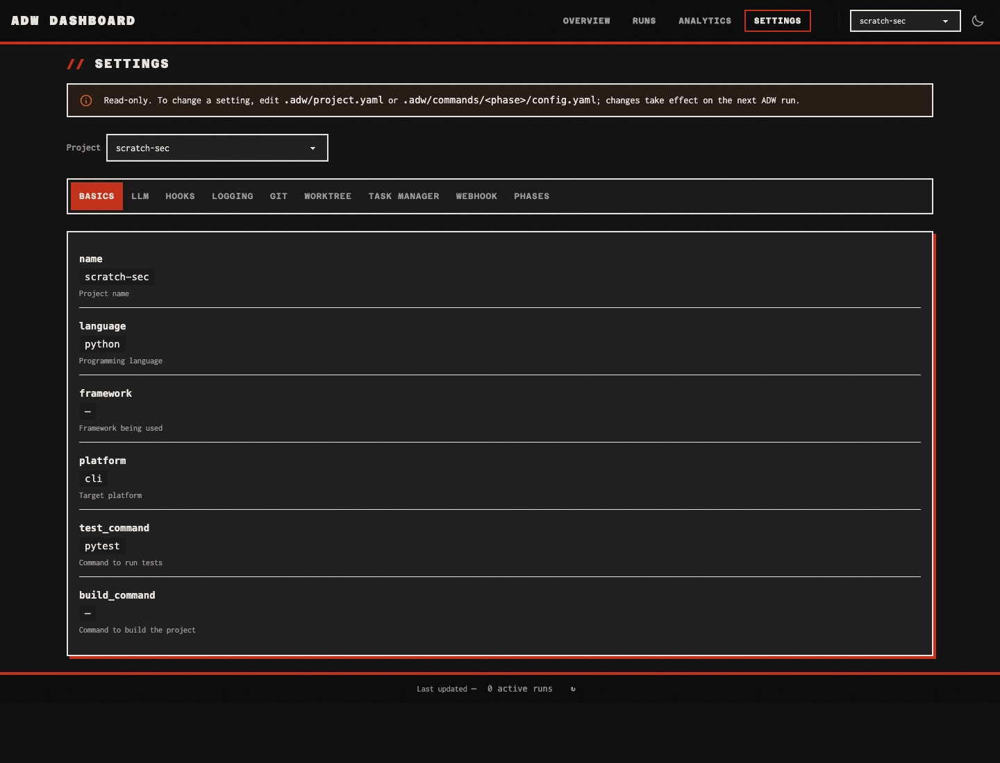

# Validation: Remove the security package

Validated on `feature/adw-17` at `9e414945`, merge-base `ad704a17` (`origin/staging`), 2026-09-24. Every CLI check ran this worktree's code through `uv run --project "$WORKTREE" adw …`.

## Acceptance criteria

| Criterion | Result | Evidence |
|---|---|---|
| The plan grep (`SecurityInterceptor`, `SecurityConfig`, `SecurityError`, `allow_dangerous`, `allow-dangerous`, `security_interceptor`, `adw\.security`) over `src tests` returns nothing, and so does the epic's literal grep | Met | [Greps](#greps): both exit 1 with no output |
| A `project.yaml` that still has a `security:` section loads without error | Met | `test_load_ignores_legacy_security_section` (RED before TASK-002, green after). [`adw validate`](#adw-validate-on-a-legacy-config) on a scratch project: 0 errors, exit 0 |
| `adw init --wizard` asks no security questions | Met | [Wizard transcripts](#wizard): before, `Step 8/10: Security Settings` and `Security: Default`; after, 9 steps and no "security" anywhere in the transcript. The generated config passes `adw validate` |
| The dashboard settings page renders without a security section | Met | `test_legacy_security_section_is_not_shown` (RED before TASK-002). [Screenshot](#screenshot) of `/settings` for the scratch project with a `security:` section: no Security tab, no `security` row; the page HTML has 0 occurrences of "security" |
| `adw run --allow-dangerous` fails with "No such option" | Met | [Transcript](#removed-option): `No such option: --allow-dangerous`, exit 2 |
| `uvx vulture src/adw --min-confidence 60`, diffed against the merge-base, reports no new entry | Met | [Vulture diff](#vulture-diff): `comm -13` empty; 14 entries left with the deleted code |
| `scripts/preflight.sh` passes, and `uv run pytest` is green with coverage ≥ 80% | Met | [Preflight and tests](#preflight-and-tests): `preflight: ok`; 3,436 passed, 5 skipped, 84.99%. CI on PR #215: lint, typecheck and test pass |

## Preflight and tests

```text
$ scripts/preflight.sh
==> ruff check
All checks passed!
==> ruff format --check
344 files already formatted
==> mypy
Success: no issues found in 146 source files
preflight: ok

$ uv run pytest
TOTAL                                    11232   1472   3196    321    85%
Required test coverage of 80% reached. Total coverage: 84.99%
================= 3436 passed, 5 skipped in 197.62s (0:03:17) ==================
```

The baseline at `ad704a17` was 3,581 passed, 5 skipped, 85.34%. The branch deletes 147 tests and adds 2, a net drop of 145. Coverage fell 0.35 points because the deleted security package was better covered than average.

RED runs before each GREEN step:

```text
# TASK-002, before removing ProjectConfig.security
FAILED tests/unit/config/test_loader.py::TestConfigLoader::test_load_ignores_legacy_security_section
FAILED tests/unit/dashboard/test_settings.py::TestSettingsContext::test_legacy_security_section_is_not_shown
FAILED tests/unit/config/test_yaml_generator.py::TestYAMLWithComments::test_generate_project_yaml_has_all_sections
3 failed, 31 passed in 0.40s

# TASK-003, before removing the wizard step
FAILED tests/unit/cli/wizard/test_summary.py::TestSummaryPanelGeneration::test_summary_panel_shows_all_sections
1 failed, 32 passed in 0.39s
```

## Greps

```text
$ grep -rn --exclude-dir=__pycache__ "SecurityInterceptor\|SecurityConfig\|SecurityError\|allow_dangerous\|allow-dangerous\|security_interceptor\|adw\.security" src tests
exit=1

$ find src tests -type d -name __pycache__ -prune -exec rm -rf {} +
$ grep -rn "SecurityInterceptor\|SecurityConfig\|SecurityError\|allow_dangerous\|adw.security" src tests
exit=1

$ uv run python -c "import importlib.util as u; print('adw.security importable:', u.find_spec('adw.security') is not None)"
adw.security importable: False
```

## adw validate on a legacy config

```text
$ cat .adw/project.yaml
name: scratch-sec
language: python
test_command: pytest

security:
  blocked_patterns:
    - pattern: "rm -rf"
      description: "Recursive delete"
      category: destructive
  blocked_env_files:
    - '\.secrets$'

$ uv run --project "$WORKTREE" adw validate

╭─────────────────────╮
│ Configuration Check │
╰─────────────────────╯

  .adw/project.yaml ....................... OK
  plan .................................... OK
  build ................................... OK
  validate ................................ OK
  document ................................ OK
  ship .................................... OK

  Result: 0 errors, 0 warnings — configuration is valid

exit=0
```

## Wizard

`yes "" | head -60 | NO_COLOR=1 COLUMNS=100 uv run --project "$WORKTREE" adw init --wizard`, in a fresh scratch git repo with a scratch `HOME`, accepting every default.

Before (`ad704a17`, captured during planning):

```text
Step 7/10: LLM Retry Settings
...
Configure LLM retry behavior? [y/n] (n):
Step 8/10: Security Settings
──────────────────────────────────────────────────

Security settings control what operations ADW is allowed to perform.
Default: Dangerous operations blocked, standard protections active.

Configure security settings? [y/n] (n):
Step 9/10: Webhook Configuration
...
│ LLM Retry: Default                                                           │
│ Security: Default                                                            │
│ Webhooks: Disabled                                                           │
```

After (`9e414945`):

```text
Step 7/9: LLM Retry Settings
...
Configure LLM retry behavior? [y/n] (n):
Step 8/9: Webhook Configuration
──────────────────────────────────────────────────
Set up webhook server? [y/n] (n):
Step 9/9: Configuration Summary
...
│ LLM Retry: Default                                                                               │
│ Webhooks: Disabled                                                                               │
...
✓ Configuration created!

$ grep -ci security wizard-after.txt
0
$ grep -ci security .adw/project.yaml
0
$ uv run --project "$WORKTREE" adw validate
  Result: 0 errors, 0 warnings — configuration is valid
```

## Screenshot

`adw dashboard web --port 8917` with a scratch `HOME` whose registry holds only `scratch-sec`, the project whose `project.yaml` has the `security:` section above. `/` and `/settings?project=scratch-sec` both return 200; the settings page offers the tabs `project`, `llm`, `hooks`, `logging`, `git`, `worktree`, `task_manager`, `webhook` and `phases`, and its HTML contains "security" 0 times.



## Removed option

```text
$ uv run --project "$WORKTREE" adw run --allow-dangerous x
Usage: adw run [OPTIONS] [FEATURE_DESCRIPTION]
Try 'adw run --help' for help.
╭─ Error ──────────────────────────────────────────────────────────────────────────────────────────╮
│ No such option: --allow-dangerous                                                                │
╰──────────────────────────────────────────────────────────────────────────────────────────────────╯
exit=2
```

## Vulture diff

`uvx vulture src/adw --min-confidence 60`, line numbers stripped and sorted, at the merge-base and at `9e414945`.

```text
$ comm -13 vulture-before.txt vulture-after.txt     # new entries
(empty)

$ comm -23 vulture-before.txt vulture-after.txt     # entries gone with the deleted code
src/adw/models/security.py: unused class 'ToolCallLog' (60% confidence)
src/adw/models/security.py: unused variable 'block_reason' (60% confidence)
src/adw/models/security.py: unused variable 'result_summary' (60% confidence)
src/adw/security/interceptor.py: unused method 'validate_and_raise' (60% confidence)
src/adw/security/interceptor.py: unused variable 'command_or_path' (60% confidence)
src/adw/security/override.py: unused function 'get_override_logger' (60% confidence)
src/adw/security/override.py: unused function 'reset_override_logger' (60% confidence)
src/adw/security/override.py: unused method 'get_override_count' (60% confidence)
src/adw/security/override.py: unused method 'get_overrides_by_category' (60% confidence)
src/adw/security/override.py: unused method 'get_summary' (60% confidence)
src/adw/security/override.py: unused method 'log_override' (60% confidence)
src/adw/security/suggestions.py: unused class 'SuggestionFormatter' (60% confidence)
src/adw/security/suggestions.py: unused function 'get_category_examples' (60% confidence)
src/adw/security/suggestions.py: unused method 'format_error_message' (60% confidence)
```

`validate_and_raise` — the interceptor's only raising entry point — was already unused before this change, which confirms the package never blocked anything.

## Divergence from the plan

- **TASK-003's case-insensitive grep has one hit.** `grep -rn -i --exclude-dir=__pycache__ "security" src/adw/cli tests/unit/cli` finds `assert "Security:" not in output` in `test_summary.py`. The same task asks for that flipped assertion as its RED test, so the two criteria collide; the assertion stays, and nothing else in `src/adw/cli` or `tests/unit/cli` mentions security.
- **Branch.** The plan kept `feature/adw-17`, the branch this worktree was created on at `origin/staging`'s tip, instead of cutting a new one with `prepare_branch.sh`.
- **Empty directories.** `git rm` left empty `src/adw/security/` and `tests/unit/security/` directories in the worktree once the bytecode was cleared; an empty `src/adw/security/` would still import as a namespace package. They were removed. Git doesn't track directories, so the branch is unaffected.

## Plan validation (pre-implementation, Codex)

### Rounds

| Round | Findings | Applied | Deferred | Rejected |
|-------|----------|---------|----------|----------|
| 1     | 1        | 1       | 0        | 0        |
| 2     | 2        | 2       | 0        | 0        |
| 3     | 3        | 3       | 0        | 0        |

Round 3 still produced `apply` rows. The run was autonomous by the user's instruction, so the call was to apply them and stop: they concern validation mechanics and test hygiene, not the plan's structure.

### Applied

#### Round 1
- `PLAN.md`, `RESEARCH.md`, `TASK-001`–`TASK-004` — every absence grep excludes `__pycache__`, so bytecode that `git rm` leaves behind can't fail a correct change (round-1 #1)

#### Round 2
- `TASK-004` — clear stale `__pycache__` under `src` and `tests`, then run the epic's phase-2.1 grep verbatim as the evidence for ticking it (round-2 #1)
- `TASK-004` — the first step requires TASK-001 to TASK-003, not every task including TASK-004 itself (round-2 #2)

#### Round 3
- `PLAN.md:Acceptance Criteria`, `TASK-004` — every functional check runs `uv run --project "$WORKTREE" adw …`; the `adw` on `PATH` is installed from another checkout (round-3 #1)
- `PLAN.md:Acceptance Criteria`, `TASK-003`, `TASK-004` — the plan grep also covers `allow-dangerous` and `security_interceptor`, and escapes `adw\.security` (round-3 #2)
- `PLAN.md:Risks`, `TASK-003` — delete the wizard's enum-existence and step-count tests (ADR-001 waste) instead of editing them (round-3 #3)

### Deferred

- None.

### Rejected

- None.
